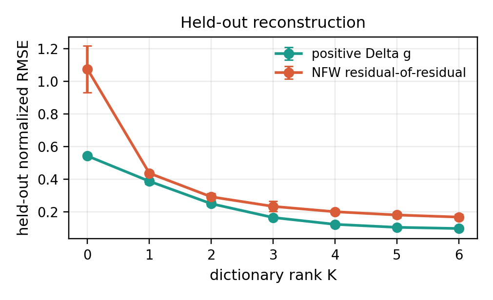
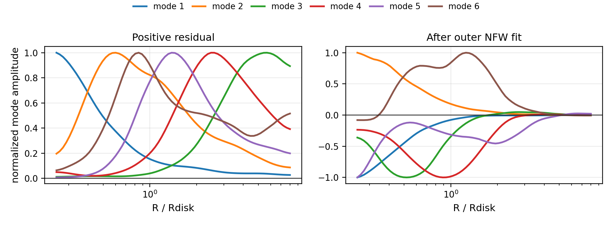
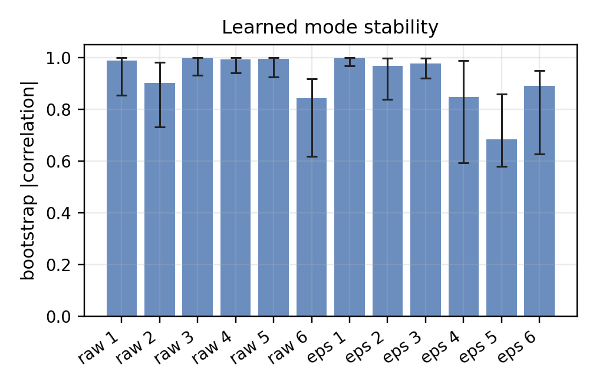
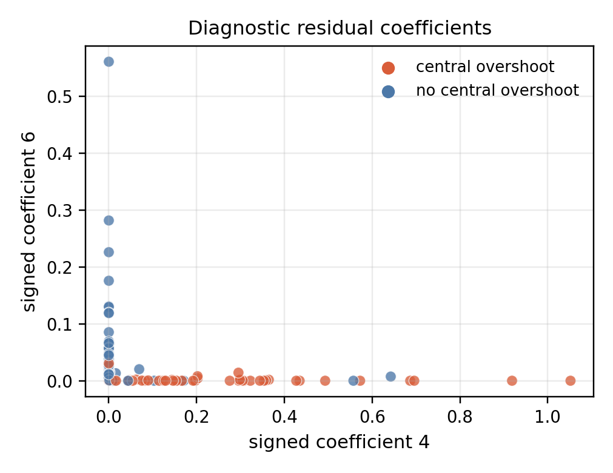

# SPARC Residual Dictionary Learning

**Author:** J. R. Landers  
**Date:** May 2026

## Summary

This experiment adds a population learning layer on top of the SPARC
NFW residual-of-residual experiment. It uses the primary-quality SPARC
galaxies already processed in `../sparc_nfw_residuals/`, places their residual
profiles on a common normalized radius grid, and learns low-rank residual
dictionaries.

Two targets are learned:

1. A nonnegative dictionary for the positive observed acceleration residual,
   $\max(\Delta g_{\rm obs},0)$.
2. A signed two-channel dictionary for the NFW residual-of-residual,
   $\epsilon_g=\Delta g_{\rm obs}-\Delta g_{\rm NFW,outer}$.

The signed dictionary is learned by splitting the field into positive and
negative channels,

$$
\epsilon_g(r)=\epsilon_g^+(r)-\epsilon_g^-(r),
\qquad
\epsilon_g^\pm(r)\ge 0,
$$

and fitting

$$
X_i(r)\approx \sum_{k=1}^K a_{ik}\phi_k(r),
\qquad
a_{ik}\ge 0.
$$

## Dataset

- Source experiment: `experiments/sparc_nfw_residuals`
- Galaxies used after quality and radial-coverage cuts: **131**
- Radius coordinate: $R/R_d$
- Common grid: **72** log-spaced points from **0.25** to **8.0** $R/R_d$
- Mean grid coverage per galaxy: **0.774**
- Central-overshoot fraction in this learned sample: **0.519**
- Cored/isothermal beats full-range NFW fraction in this learned sample: **0.802**

Each galaxy is normalized by its observed residual RMS before learning. This
makes the learned dictionaries primarily shape dictionaries rather than galaxy
mass-scale dictionaries.

## Model Selection

Model selection uses held-out radial points, not held-out galaxies. For each
rank $K$, 15 percent of observed radial grid entries are held out per split,
the dictionary is trained on the remaining entries, and reconstruction is
scored on the held-out entries. Rank zero is the learned population mean.

| target | rank | holdout_profile_rmse | holdout_profile_rmse_std | holdout_channel_rmse |
| --- | --- | --- | --- | --- |
| positive_delta_g | 0 | 0.543 | 0.012 | 0.431 |
| positive_delta_g | 6 | 0.098 | 0.006 | 0.056 |
| signed_nfw_residual_of_residual | 0 | 1.075 | 0.143 | 0.531 |
| signed_nfw_residual_of_residual | 6 | 0.168 | 0.017 | 0.060 |

The selected positive-residual dictionary has **K=6**. Its
held-out normalized profile RMSE is **0.098**, compared with
**0.543** for the population-mean baseline.

The selected signed NFW residual-of-residual dictionary has **K=6**.
Its held-out normalized profile RMSE is **0.168**, compared with
**1.075** for the population-mean baseline.

Both targets improve monotonically up to the largest searched rank, $K=6$.
That is informative but also a caveat: this run shows strong compressible
structure, but it does not identify a sharp intrinsic rank. In the paper
narrative, $K=6$ should be treated as the searched dictionary size, while the
bootstrap table below identifies which modes are stable enough to interpret.

## Learned Modes

The positive-residual modes are broad, smooth acceleration-residual shapes.
The signed residual-of-residual modes are more diagnostic: they describe
structured departures left after NFW has been forced to match the outer
rotation-curve residual.

The closest simple template for each learned mode is shown below. A negative
correlation means the learned mode is closer to the opposite of that named
template.

| target | mode | template_match | correlation | abs_correlation |
| --- | --- | --- | --- | --- |
| positive_delta_g | 1 | nfw_like_rs1 | 0.914 | 0.914 |
| positive_delta_g | 2 | central_peak | 0.968 | 0.968 |
| positive_delta_g | 3 | opposite_of_nfw_like_rs3 | -0.943 | 0.943 |
| positive_delta_g | 4 | opposite_of_nfw_like_rs1 | -0.818 | 0.818 |
| positive_delta_g | 5 | cored_isothermal_xc1 | 0.574 | 0.574 |
| positive_delta_g | 6 | cored_isothermal_xc1 | 0.655 | 0.655 |
| signed_nfw_residual_of_residual | 1 | negative_inner_overshoot | 0.869 | 0.869 |
| signed_nfw_residual_of_residual | 2 | opposite_of_negative_inner_overshoot | -0.936 | 0.936 |
| signed_nfw_residual_of_residual | 3 | negative_inner_overshoot | 0.877 | 0.877 |
| signed_nfw_residual_of_residual | 4 | slope_mismatch_inner_neg_outer_pos | 0.653 | 0.653 |
| signed_nfw_residual_of_residual | 5 | positive_outer_tail | 0.621 | 0.621 |
| signed_nfw_residual_of_residual | 6 | opposite_of_slope_mismatch_inner_neg_outer_pos | -0.374 | 0.374 |

## Bootstrap Stability

Mode stability is measured by bootstrapping galaxies, refitting the selected
dictionary, and matching each bootstrap mode back to the reference dictionary
by absolute profile correlation.

| target | mode | median | q10 | q90 |
| --- | --- | --- | --- | --- |
| positive_delta_g | 1 | 0.988 | 0.853 | 0.999 |
| positive_delta_g | 2 | 0.901 | 0.732 | 0.981 |
| positive_delta_g | 3 | 0.996 | 0.931 | 0.999 |
| positive_delta_g | 4 | 0.991 | 0.941 | 0.998 |
| positive_delta_g | 5 | 0.994 | 0.923 | 0.999 |
| positive_delta_g | 6 | 0.841 | 0.617 | 0.917 |
| signed_nfw_residual_of_residual | 1 | 0.997 | 0.967 | 1.000 |
| signed_nfw_residual_of_residual | 2 | 0.967 | 0.838 | 0.996 |
| signed_nfw_residual_of_residual | 3 | 0.976 | 0.919 | 0.997 |
| signed_nfw_residual_of_residual | 4 | 0.846 | 0.593 | 0.987 |
| signed_nfw_residual_of_residual | 5 | 0.684 | 0.579 | 0.858 |
| signed_nfw_residual_of_residual | 6 | 0.890 | 0.626 | 0.949 |

## Relation To Existing Residual Diagnostics

The table below reports associations between learned coefficients and the
pre-existing NFW residual diagnostics.

| target | mode | feature | association_type | correlation | standardized_difference |
| --- | --- | --- | --- | --- | --- |
| positive_delta_g | 1 | central_overshoot_after_outer_nfw | binary_mean_difference | -0.205 | -0.410 |
| positive_delta_g | 1 | inner_gap_mean_norm_after_outer_nfw | pearson | 0.186 | nan |
| positive_delta_g | 2 | central_overshoot_after_outer_nfw | binary_mean_difference | -0.377 | -0.754 |
| positive_delta_g | 2 | inner_gap_mean_norm_after_outer_nfw | pearson | 0.376 | nan |
| positive_delta_g | 3 | central_overshoot_after_outer_nfw | binary_mean_difference | 0.169 | 0.339 |
| positive_delta_g | 3 | inner_gap_mean_norm_after_outer_nfw | pearson | -0.155 | nan |
| positive_delta_g | 4 | central_overshoot_after_outer_nfw | binary_mean_difference | 0.309 | 0.619 |
| positive_delta_g | 4 | inner_gap_mean_norm_after_outer_nfw | pearson | -0.369 | nan |
| positive_delta_g | 5 | central_overshoot_after_outer_nfw | binary_mean_difference | -0.087 | -0.174 |
| positive_delta_g | 5 | inner_gap_mean_norm_after_outer_nfw | pearson | 0.026 | nan |
| positive_delta_g | 6 | central_overshoot_after_outer_nfw | binary_mean_difference | -0.050 | -0.100 |
| positive_delta_g | 6 | inner_gap_mean_norm_after_outer_nfw | pearson | 0.154 | nan |
| signed_nfw_residual_of_residual | 1 | central_overshoot_after_outer_nfw | binary_mean_difference | 0.232 | 0.464 |
| signed_nfw_residual_of_residual | 1 | inner_gap_mean_norm_after_outer_nfw | pearson | -0.244 | nan |
| signed_nfw_residual_of_residual | 2 | central_overshoot_after_outer_nfw | binary_mean_difference | -0.203 | -0.406 |
| signed_nfw_residual_of_residual | 2 | inner_gap_mean_norm_after_outer_nfw | pearson | 0.228 | nan |
| signed_nfw_residual_of_residual | 3 | central_overshoot_after_outer_nfw | binary_mean_difference | -0.036 | -0.071 |
| signed_nfw_residual_of_residual | 3 | inner_gap_mean_norm_after_outer_nfw | pearson | -0.023 | nan |
| signed_nfw_residual_of_residual | 4 | central_overshoot_after_outer_nfw | binary_mean_difference | 0.413 | 0.826 |
| signed_nfw_residual_of_residual | 4 | inner_gap_mean_norm_after_outer_nfw | pearson | -0.592 | nan |
| signed_nfw_residual_of_residual | 5 | central_overshoot_after_outer_nfw | binary_mean_difference | 0.219 | 0.439 |
| signed_nfw_residual_of_residual | 5 | inner_gap_mean_norm_after_outer_nfw | pearson | -0.267 | nan |
| signed_nfw_residual_of_residual | 6 | central_overshoot_after_outer_nfw | binary_mean_difference | -0.371 | -0.743 |
| signed_nfw_residual_of_residual | 6 | inner_gap_mean_norm_after_outer_nfw | pearson | 0.318 | nan |

## Interpretation

This experiment supports a clean statistical-learning extension of the
geometric-residual paper. The useful result is not merely that a hand-written
template beats another hand-written template. The SPARC residual population can
be compressed into a small number of learned, stable residual modes, and those
modes can be compared with the existing NFW/cored/central-overshoot diagnostics.

The signed residual-of-residual dictionary is the more paper-relevant object.
It directly learns the structured leftover field after the baseline NFW model
has been fit to the outer galaxy. This makes it a population-level model
criticism tool: fit the physical baseline, learn what remains, and test whether
the leftover geometry is coherent across galaxies.

## Limitations

- This is still a residual-space diagnostic, not a full halo inference.
- Stellar mass-to-light ratios, distances, and inclinations are inherited from
  the fixed-assumption SPARC residual experiment.
- The common-grid interpolation uses $R/R_d$ and does not model disk geometry.
- The NMF objective is a smooth, masked reconstruction model, not a full
  probabilistic likelihood.
- Held-out radial points test profile compression; held-out-galaxy prediction
  should be added before making strong generalization claims.

## Outputs

- `results/model_selection.csv`
- `results/raw_modes.csv`
- `results/epsilon_modes.csv`
- `results/raw_galaxy_coefficients.csv`
- `results/epsilon_galaxy_coefficients.csv`
- `results/mode_template_correlations.csv`
- `results/bootstrap_mode_stability.csv`
- `results/coefficient_associations.csv`
- `figures/model_selection.png`
- `figures/learned_modes.png`
- `figures/coefficient_space.png`
- `figures/bootstrap_stability.png`
