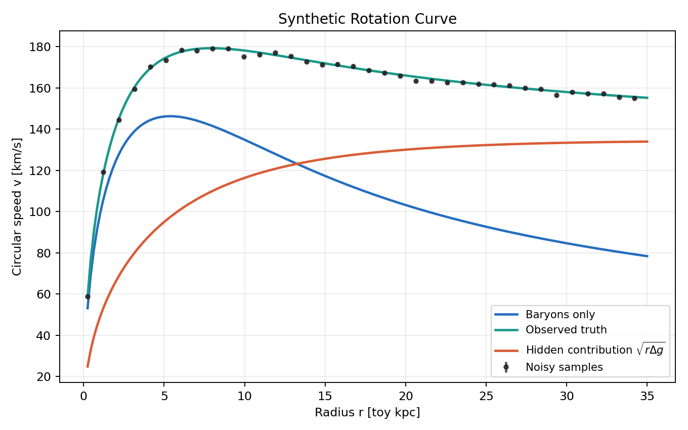
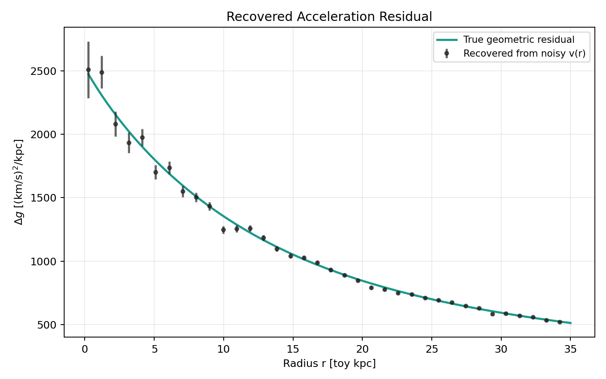
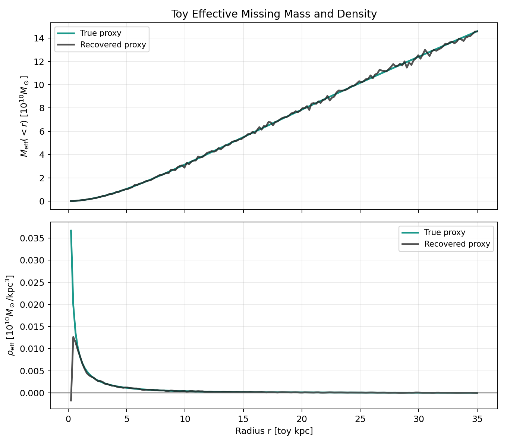
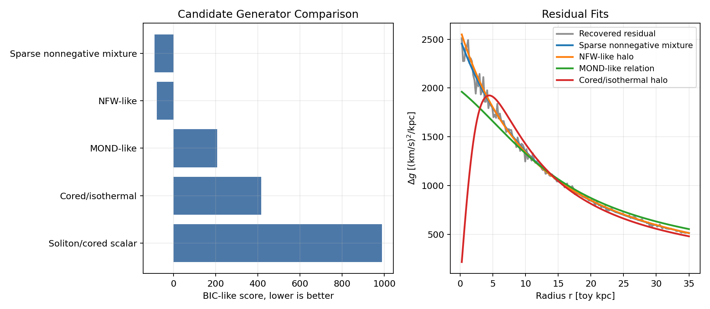
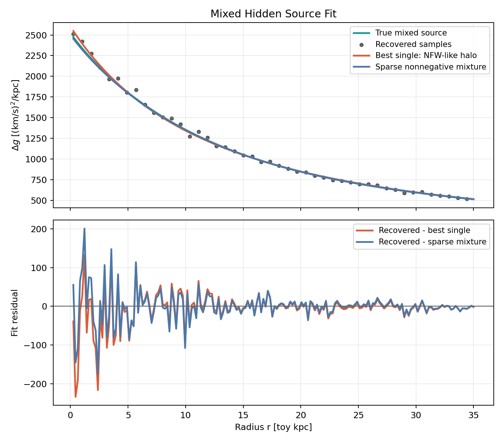
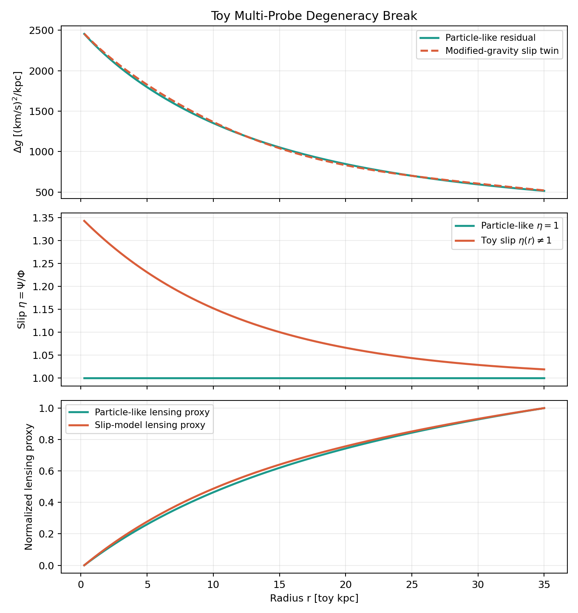
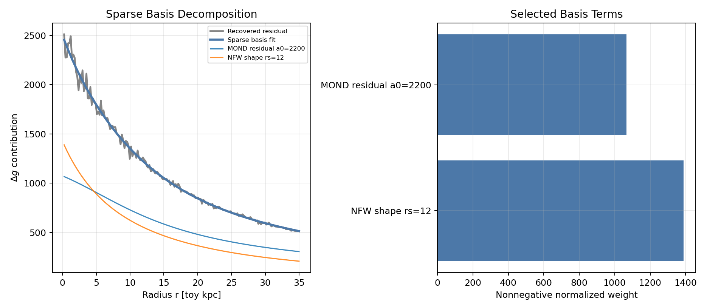

# AI Search over Geometric Residuals in the Missing-Mass Problem

**Author:** J. R. Landers  
**Date:** May 2026

## Abstract

This note turns the geometric-residual framing of the missing-mass problem into a small reproducible computational prototype. The prototype generates toy rotation-curve data, recovers the weak-field geometric residual, fits several candidate latent physical generators, compares single-source and mixed-source explanations, and adds a conceptual second observable based on gravitational slip. The goal is not to solve dark matter. It is to formalize a toy inverse-problem scaffold that can be made progressively more realistic.

## Conceptual Starting Point

The starting point is the distinction between the geometry predicted by observed baryons and the geometry implied by observations. In relativistic language, define the Einstein-tensor geometric residual

$$
\Delta G_{\mu\nu}
=
G_{\mu\nu}[g^{\rm obs}]
-
G_{\mu\nu}[g^{\rm bar}].
$$

If the Einstein equation is kept fixed, this residual can be represented as an effective missing stress-energy tensor,

$$
T_{\mu\nu}^{\rm miss}
=
\frac{c^4}{8\pi G}\Delta G_{\mu\nu}.
$$

The phrase "effective" matters. A geometric residual can be caused by particle-like dark matter, field-like sources, modified geometry laws, baryonic modeling errors, environmental effects, or observational systematics. The prototype below treats these possibilities as candidate latent physical generators of one observed residual.

## Weak-Field Galaxy Reduction

For the toy galaxy experiments, circular speed is converted into acceleration by

$$
g(r)=\frac{v^2(r)}{r}.
$$

The practical weak-field geometric residual is

$$
\Delta g(r)
=
g_{\rm obs}(r)-g_{\rm bar}(r)
=
\frac{v_{\rm obs}^2(r)-v_{\rm bar}^2(r)}{r}.
$$

The potential residual also defines an effective density proxy,

$$
\rho_{\rm eff}(r)
=
\frac{1}{4\pi G}\nabla^2\Delta\Phi.
$$

Using a spherical toy proxy,

$$
g(r) = \frac{G M(<r)}{r^2},
\qquad
M_{\rm eff}(<r)
=
\frac{r^2\Delta g(r)}{G},
$$

and

$$
\rho_{\rm eff}(r)
=
\frac{1}{4\pi r^2}\frac{dM_{\rm eff}}{dr}.
$$

This is not a realistic disk-galaxy inversion. It is a controlled spherical proxy for testing how an acceleration residual can be recovered and decomposed.

## AI-Assisted Inverse Problem

The inverse problem is to infer one or more latent generators whose induced residual matches observations:

$$
\Delta G_{\mu\nu}^{\rm obs}
\approx
\sum_k \Delta G_{\mu\nu}^{(k)}.
$$

In this toy reduction, that becomes a search over residual acceleration functions:

$$
\Delta g(r) \approx \sum_k w_k f_k(r,g_{\rm bar},\rho_{\rm bar},\nabla\rho_{\rm bar},\ldots).
$$

The basis-library fit in this prototype is deliberately modest: it uses nonnegative sparse combinations of NFW-like, cored/isothermal-like, MOND-like, soliton-like, and baryon-coupled radial functions. It is not physics discovery. It is a scaffold for later symbolic regression or differentiable search over covariant structures such as

$$
\Delta \mathcal{E}_{\mu\nu}
=
F_{\mu\nu}
\left(
g_{\mu\nu},
R_{\mu\nu},
R,
T_{\mu\nu}^{\rm bar},
\nabla_\alpha T_{\mu\nu}^{\rm bar},
\phi,
A_\mu,
\ldots
\right).
$$

## Experimental Design

The synthetic baryonic profile is

$$
M_{\rm bar}(<r) = M_b\left[1-e^{-r/R_d}(1+r/R_d)\right],
$$

with baryonic acceleration

$$
g_{\rm bar}(r)=\frac{G M_{\rm bar}(<r)}{r^2}.
$$

Five hidden/residual generators are used: an NFW-like halo, a cored/isothermal-like halo, a MOND-like acceleration residual, a soliton/cored scalar-field-inspired component, and a mixed NFW+MOND component. Gaussian velocity noise is added with a fixed random seed.

The inversion stage recovers $\Delta g$, $M_{\rm eff}$, and $\rho_{\rm eff}$ from noisy $v_{\rm obs}(r)$ and known $g_{\rm bar}(r)$. The model-comparison stage fits candidate generators and reports weighted MSE, AIC/BIC-like scores, and simple physical validity checks: positivity of $\Delta g$, monotonicity of $M_{\rm eff}$, nonnegativity of $\rho_{\rm eff}$, and absence of strong oscillatory pathologies.

The multi-probe experiment adds a conceptual lensing/slip proxy. Dynamics probes the potential $\Phi$, while lensing responds to $\Phi+\Psi$. A particle-like model is assigned $\eta=\Psi/\Phi\approx 1$, while a toy modified-gravity twin is assigned $\eta(r)\ne 1$. This is not physical lensing. It only demonstrates how a second projection can break a rotation-curve degeneracy.

## Results

### Residual Recovery

The synthetic inversion recovers the broad geometric residual in all generated cases. Noise is amplified when converting velocity to acceleration and especially when differentiating $M_{\rm eff}$ to estimate $\rho_{\rm eff}$, which is why the density proxy is the least stable derived quantity.

| component | relative_rmse_delta_g | corr_delta_g | delta_g_positive_fraction | mass_monotonic_fraction | rho_nonnegative_fraction |
| --- | --- | --- | --- | --- | --- |
| nfw_like | 0.0332 | 0.9979 | 1.0000 | 0.7207 | 0.9944 |
| cored_isothermal | 0.0494 | 0.9937 | 0.9944 | 0.7430 | 0.9833 |
| mond_like | 0.0903 | 0.9601 | 1.0000 | 0.7374 | 0.9889 |
| soliton_cored | 0.0150 | 0.9999 | 1.0000 | 0.5587 | 0.5667 |
| mixed_nfw_mond | 0.0329 | 0.9971 | 1.0000 | 0.7765 | 1.0000 |

### Candidate Generator Degeneracy

The mixed-source example illustrates the core inverse-problem issue: several candidate generators can produce broadly similar rotation residuals. The best overall BIC-like fit in this run is **Sparse nonnegative mixture**, while the best single-family fit is **NFW-like halo**. The sparse mixture is allowed to represent the missing residual as a superposition of latent mechanisms, so it can improve the fit when the truth is mixed.

| model | weighted_mse | bic | complexity | params | delta_g_positive_fraction | mass_monotonic_fraction | rho_nonnegative_fraction | pathological_oscillations |
| --- | --- | --- | --- | --- | --- | --- | --- | --- |
| Sparse nonnegative mixture | 0.5749 | -89.2464 | 2 | {"terms": "MOND residual a0=2200; NFW shape rs=12"} | 1.0000 | 1.0000 | 1.0000 | False |
| NFW-like halo | 0.6110 | -78.2834 | 2 | {"mass_scale": 30.786280969902787, "r_s": 15.95042285852726} | 1.0000 | 1.0000 | 1.0000 | False |
| MOND-like relation | 3.0655 | 206.8314 | 1 | {"a0": 2301.6491294046045} | 1.0000 | 1.0000 | 1.0000 | False |
| Cored/isothermal halo | 9.5635 | 416.8183 | 2 | {"v0": 130.6443428001366, "r_c": 4.435806645184747} | 1.0000 | 1.0000 | 0.9944 | False |
| Soliton/cored scalar | 229.1534 | 988.5764 | 2 | {"rho0": 0.006669625465676975, "r_c": 11.99999999999947} | 1.0000 | 1.0000 | 0.9944 | False |

This supports the interpretation that the residual decomposition is itself another inverse problem. The missing residual need not be one source; it may be a superposition of particle-like, field-like, baryon-coupled, modified-geometry, and systematic contributions.

### Multi-Probe Toy Constraint

The top panel uses two nearly identical rotation residuals. The lower panels assign different slip behavior and therefore different lensing proxies. This demonstrates the logic of joint constraints without pretending to compute real lensing observables.

### Sparse Basis Search

The sparse basis fit selected the following terms:

| basis | normalized_weight | contribution_rms |
| --- | --- | --- |
| MOND residual a0=2200 | 1.0666e+03 | 629.8913 |
| NFW shape rs=12 | 1.3880e+03 | 595.6919 |

This is an AI/symbolic-regression-inspired scaffold: the basis functions are hand supplied, and the search is a sparse nonnegative linear fit. A more serious version would learn across many galaxies and search over physically constrained residual structures rather than only radial profile shapes.

## Most Promising Directions

1. Replace synthetic curves with real rotation-curve data, for example SPARC-like data.
2. Use disk geometry rather than the spherical proxy used here.
3. Jointly fit rotation, lensing, stellar kinematics, gas morphology, and environmental observables.
4. Learn residual representations across galaxy populations rather than one galaxy at a time.
5. Search over physically constrained Lagrangians or field equations instead of only profile templates.
6. Enforce conservation constraints such as

$$
\nabla^\mu T_{\mu\nu}^{\rm eff}=0.
$$

7. Add priors for positivity, stability, monotonicity, and cosmological consistency.
8. Use symbolic regression, differentiable programming, and neural operators to propose candidate field equations or effective stress-energy structures.

## Limitations

This prototype uses toy units and synthetic data. The spherical approximation is not a disk-galaxy inversion. No real galaxy data are fit. No true general-relativistic metric reconstruction is attempted. The lensing proxy is conceptual, not physical lensing. The model families are simple radial templates, not full particle, field, or modified-gravity theories. The sparse basis search is not true discovery of new physics. Finally, the inverse problem is fundamentally degenerate: rotation curves alone do not uniquely identify the latent physical generator of a geometric residual.

## Conclusion

The missing-mass problem can be studied as an inverse problem over geometric residuals: infer the simplest physically valid generator, or mixture of generators, whose induced curvature residual matches observations across probes.

## References

1. Rubin, V. C., Ford, W. K., Jr., and Thonnard, N. (1980). Extended rotation curves of spiral galaxies.
2. Lelli, F., McGaugh, S. S., and Schombert, J. M. (2016). SPARC database and mass models for disk galaxies.
3. McGaugh, S. S., Lelli, F., and Schombert, J. M. (2016). Radial acceleration relation in rotationally supported galaxies.
4. Bertone, G., and Hooper, D. (2018). History and status of dark matter.
5. Mistele, T., McGaugh, S., Lelli, F., Schombert, J., and Li, P. (2024). Weak-lensing constraints related to extended flat circular velocities.
