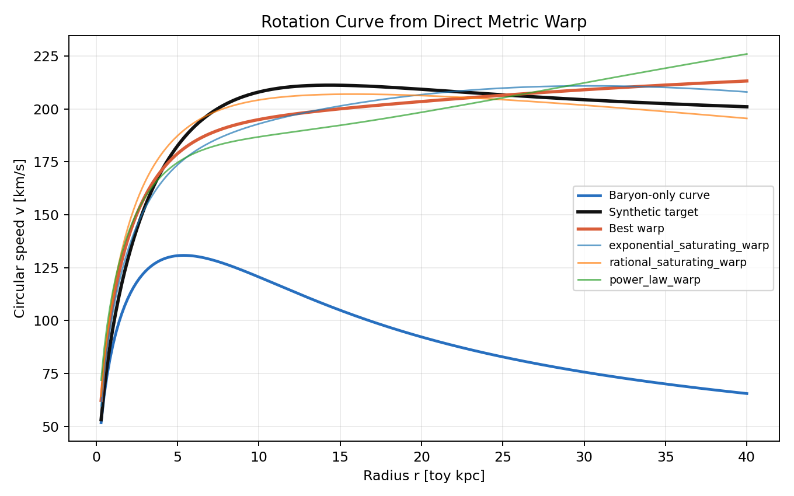
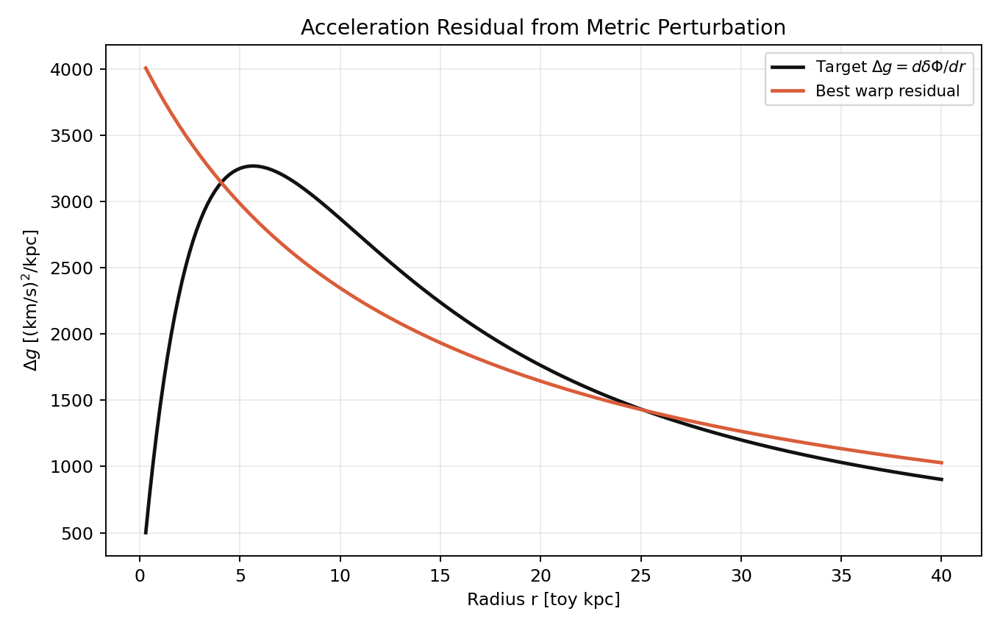
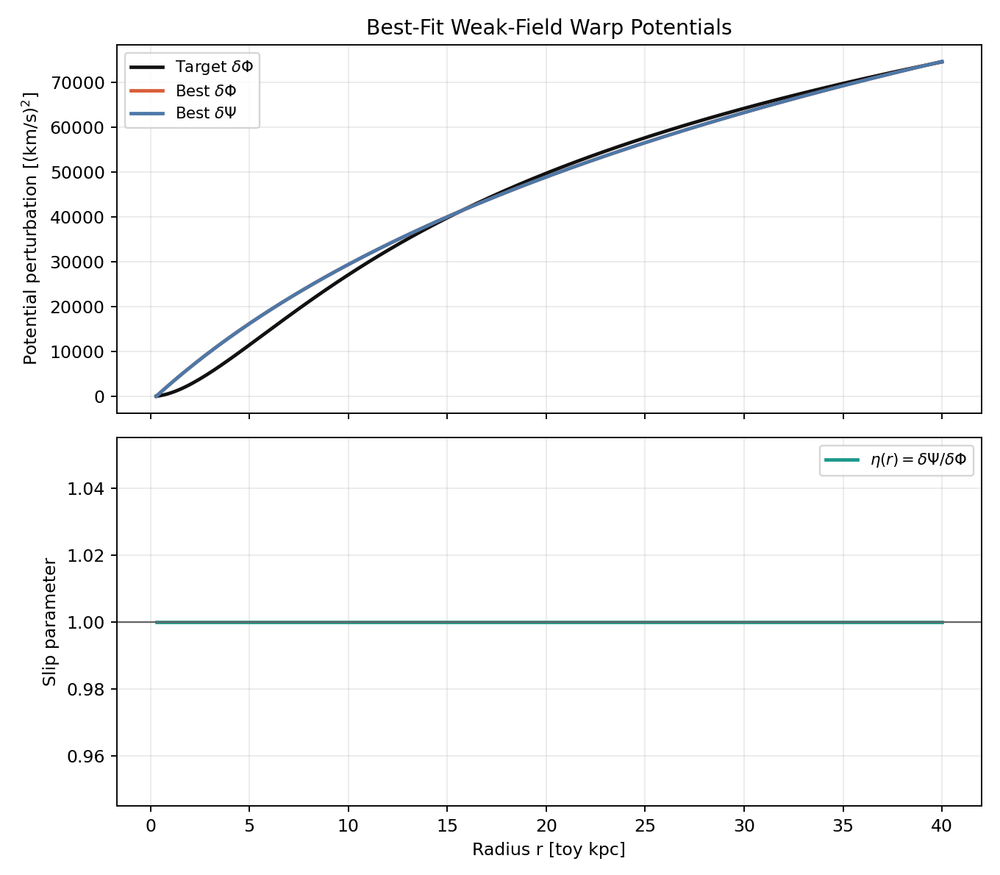
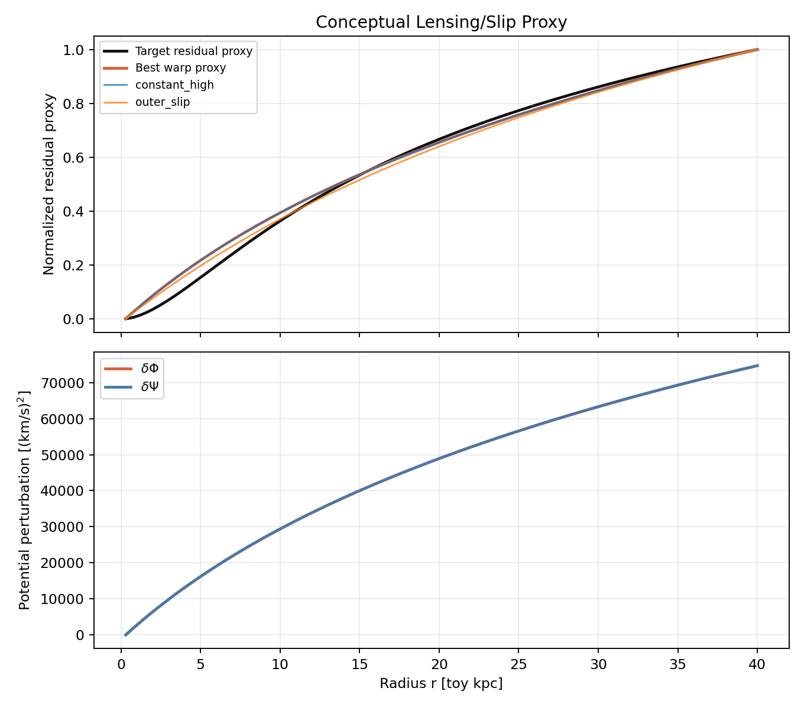
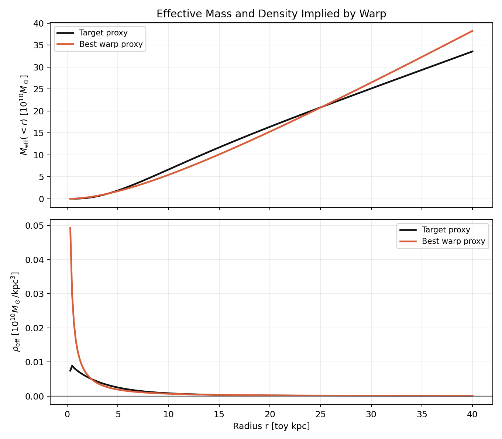
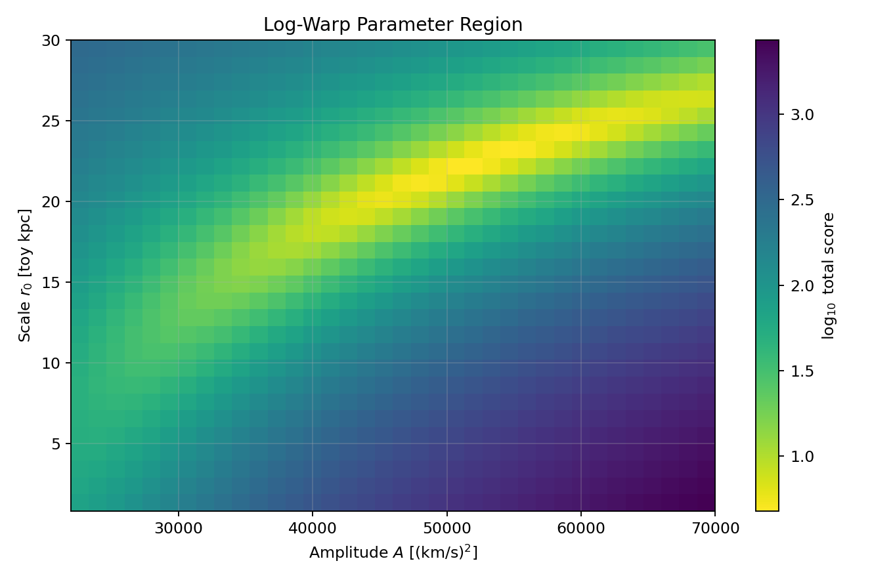
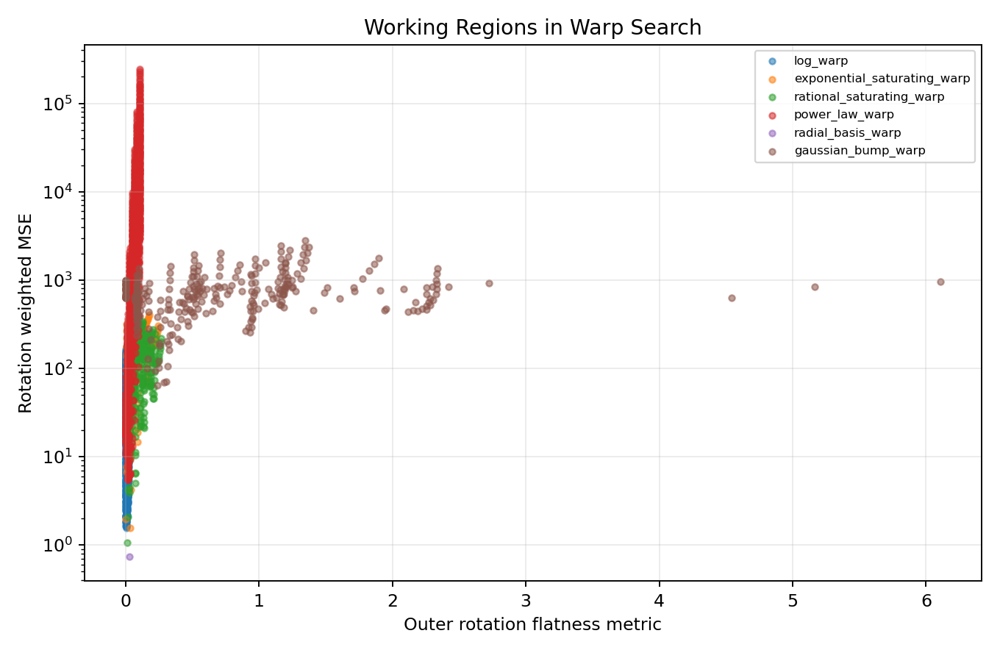
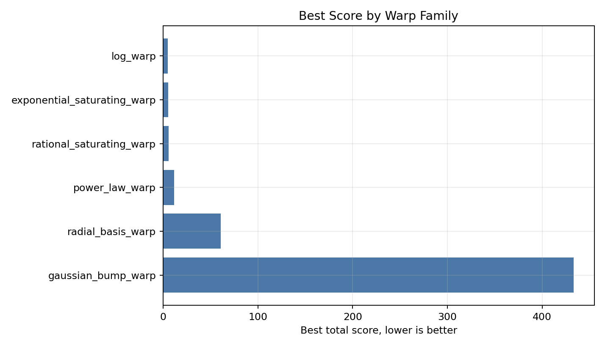
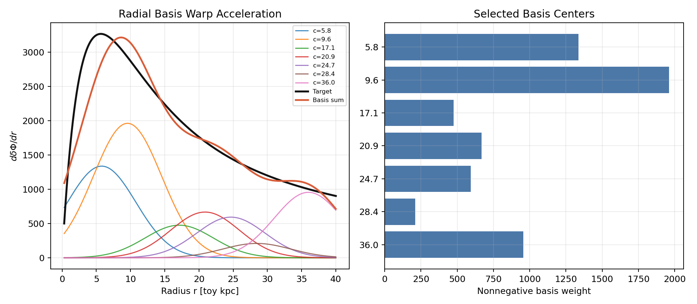

# Geometry-First Grid Search over Weak-Field Spacetime Warps

**Author:** J. R. Landers  
**Date:** May 2026

## Abstract

This research note builds a toy computational experiment for exploring the missing-mass problem without starting from named dark-matter or modified-gravity theories. The experiment searches directly over parameterized weak-field metric perturbations, or spacetime warps, and asks which geometric deformations reproduce a synthetic galaxy-like rotation residual. The result is a geometry-first scaffold: candidate warps are ranked by their rotation-curve fit, weak-field consistency, smoothness, effective density behavior, and a conceptual lensing/slip proxy. The model is intentionally synthetic and radial; it is not a solution to dark matter.

## Conceptual Motivation

The missing-mass problem can be reframed as a search for geometric perturbations that transform a baryon-predicted metric into an observation-compatible metric:

\[
g_{\mu\nu}^{\rm trial}
=
g_{\mu\nu}^{\rm bar}
+
h_{\mu\nu}(\theta).
\]

The question is not initially "which named theory is correct?" The question is more primitive: what kinds of metric perturbations numerically generate the residual, and what effective physical structure would those perturbations imply?

## Weak-Field Metric Ansatz

The prototype uses a static weak-field radial ansatz:

\[
ds^2
=
-\left(1+\frac{2\Phi(r)}{c^2}\right)c^2dt^2
+
\left(1-\frac{2\Psi(r)}{c^2}\right)
\left(dr^2+r^2d\Omega^2\right).
\]

The baryonic metric potentials are perturbed as

\[
\Phi(r)=\Phi_{\rm bar}(r)+\delta\Phi(r;\theta),
\qquad
\Psi(r)=\Psi_{\rm bar}(r)+\delta\Psi(r;\theta).
\]

Rotation curves mostly constrain

\[
v^2(r)=r\frac{d\Phi}{dr},
\qquad
\Delta g(r)=\frac{d}{dr}\delta\Phi(r),
\]

while a lensing-like projection is sensitive to a combination closer to

\[
L(r)\propto \Phi(r)+\Psi(r).
\]

The potential zero point is arbitrary in this toy calculation; derivatives and relative profiles carry the information.

## Warp Search Space

The grid search explores direct geometric perturbation families:

\[
\delta\Phi(r)=A\log(1+r/r_0),
\]

\[
\delta\Phi(r)=A(r/r_0)^\alpha,
\]

\[
\delta\Phi(r)=A(1-e^{-r/r_0}),
\qquad
\delta\Phi(r)=A\frac{r^n}{r^n+r_0^n},
\]

\[
\delta\Phi(r)=A\exp\left[-\frac{(r-r_c)^2}{2\sigma^2}\right],
\]

plus a nonnegative radial basis warp,

\[
\frac{d}{dr}\delta\Phi(r)
\approx
\sum_k a_k\exp\left[-\frac{(r-c_k)^2}{2s^2}\right],
\qquad
a_k\ge 0.
\]

The second potential is parameterized by a slip-like relation,

\[
\delta\Psi(r)=\eta(r;\lambda)\delta\Phi(r),
\]

with no-slip, constant-slip, inner-slip, and outer-slip variants.

## Grid-Search Objective

Each trial warp is scored by

\[
\mathcal{J}(\theta)
=
\sum_i
\frac{[v_{\rm trial}(r_i;\theta)-v_{\rm obs}(r_i)]^2}{\sigma_i^2}
+
\lambda_1 S_{\rm smooth}
+
\lambda_2 P_{\rm path}
+
\lambda_3 P_{\rm weak}
+
\lambda_4 C(\theta)
+
\lambda_5 P_{\rm lens}.
\]

The path penalty tracks negative residual acceleration, nonmonotone effective mass, negative effective density, and oscillatory behavior. Weak-field validity is tracked using \(\max |\Phi|/c^2\). The lensing term is a conceptual proxy, not a physical lensing calculation.

The effective density proxy is

\[
\rho_{\rm eff}(r)
=
\frac{1}{4\pi G r^2}
\frac{d}{dr}
\left[
r^2\frac{d}{dr}\delta\Phi(r)
\right].
\]

## Numerical Experiments

The baryonic cumulative mass profile is

\[
M_{\rm bar}(<r)
=
M_b\left[1-e^{-r/R_d}(1+r/R_d)\right],
\qquad
g_{\rm bar}(r)=\frac{GM_{\rm bar}(<r)}{r^2}.
\]

The synthetic observed curve is built by adding an empirical flat-speed component,

\[
v_{\rm obs}^2(r)
=
v_{\rm bar}^2(r)
+
\left[v_f(1-e^{-r/r_f})\right]^2.
\]

This target makes the required outer residual approximately

\[
\Delta g_{\rm target}(r)\sim \frac{v_f^2}{r},
\]

which is why logarithmic potential warps are expected to be competitive.

## Results

The best-ranked trial in this run is **log_warp** with slip mode **no_slip** and total score **4.7852**.

### Rotation and Residual Fit

The best direct warp reproduces the smooth flat-curve residual without naming a physical source. The important output is not a theory label; it is the shape of \(\delta\Phi\), its derivative, and the effective density structure implied by the warp.

### Metric Potentials and Slip

Rotation fixes \(d\Phi/dr\), but it does not uniquely determine \(\Psi\). The slip proxy demonstrates how two perturbations with similar rotation behavior can separate under a second projection.

### Effective Curvature/Density Proxy

Successful long-range warps imply an extended effective density proxy. In this toy target, the outer flat rotation curve pushes the search toward perturbations whose derivative falls roughly like \(1/r\), corresponding to a logarithmic potential over the searched radial range.

### Parameter Regions

The heatmap shows the region of the logarithmic family that works. The scatter plot compares fit quality and outer flatness across families.

### Basis Warp

The radial basis warp is not a named physical theory; it is an agnostic function approximator for \(d\delta\Phi/dr\). It provides a useful check on whether a simple analytic warp is missing structure.

### Top-Ranked Candidates

| family | eta_mode | total_score | rotation_mse | lensing_mse | flatness_metric | weak_field_max | params |
| --- | --- | --- | --- | --- | --- | --- | --- |
| log_warp | no_slip | 4.7852 | 2.0763 | 0.1180 | 0.0117 | 1.3904e-06 | {"A": 54914.28571428571, "r0": 13.407151859613021} |
| log_warp | no_slip | 4.7975 | 1.9535 | 0.1534 | 0.0092 | 1.3841e-06 | {"A": 50800.0, "r0": 11.723008346614838} |
| log_warp | no_slip | 4.8196 | 1.7910 | 0.2030 | 0.0095 | 1.4064e-06 | {"A": 52171.428571428565, "r0": 11.723008346614838} |
| log_warp | no_slip | 5.0265 | 2.1502 | 0.1543 | 0.0120 | 1.4111e-06 | {"A": 56285.71428571428, "r0": 13.407151859613021} |
| log_warp | no_slip | 5.0740 | 1.9001 | 0.2324 | 0.0070 | 1.3940e-06 | {"A": 48057.142857142855, "r0": 10.25041904006358} |
| log_warp | no_slip | 5.1222 | 2.2003 | 0.1694 | 0.0114 | 1.3696e-06 | {"A": 53542.857142857145, "r0": 13.407151859613021} |
| log_warp | no_slip | 5.2280 | 2.5194 | 0.1042 | 0.0143 | 1.3895e-06 | {"A": 59028.57142857143, "r0": 15.333241747510177} |
| log_warp | no_slip | 5.3743 | 1.6432 | 0.3786 | 0.0073 | 1.4178e-06 | {"A": 49428.57142857143, "r0": 10.25041904006358} |
| log_warp | no_slip | 5.4456 | 2.3426 | 0.2065 | 0.0088 | 1.3618e-06 | {"A": 49428.57142857143, "r0": 11.723008346614838} |
| log_warp | no_slip | 5.4704 | 2.4739 | 0.1809 | 0.0140 | 1.3703e-06 | {"A": 57657.142857142855, "r0": 15.333241747510177} |

### Family Summary

| family | count | best_total_score | best_rotation_mse | best_lensing_mse | best_eta_mode | best_flatness_metric | best_weak_field_max |
| --- | --- | --- | --- | --- | --- | --- | --- |
| log_warp | 5040 | 4.7852 | 2.0763 | 0.1180 | no_slip | 0.0117 | 1.3904e-06 |
| exponential_saturating_warp | 640 | 5.6135 | 1.9764 | 0.3727 | no_slip | 0.0040 | 1.3517e-06 |
| rational_saturating_warp | 2560 | 6.0670 | 1.0534 | 0.2698 | constant_low | 0.0149 | 1.4592e-06 |
| power_law_warp | 6300 | 11.6641 | 6.2762 | 0.3203 | no_slip | 0.0340 | 1.3799e-06 |
| radial_basis_warp | 5 | 60.6587 | 0.7383 | 0.1750 | no_slip | 0.0300 | 1.3611e-06 |
| gaussian_bump_warp | 1680 | 433.2462 | 71.2617 | 3.1297 | constant_high | 0.3062 | 1.2917e-06 |

### Selected Basis Terms

| center | width | weight |
| --- | --- | --- |
| 5.7778 | 5.0000 | 1.3374e+03 |
| 9.5556 | 5.0000 | 1.9622e+03 |
| 17.1111 | 5.0000 | 475.6548 |
| 20.8889 | 5.0000 | 667.2866 |
| 24.6667 | 5.0000 | 593.1088 |
| 28.4444 | 5.0000 | 209.5958 |
| 36.0000 | 5.0000 | 955.1286 |

## Interpretation

The successful warps tend to be smooth and long-range. The flat target curve favors perturbations with \(d\delta\Phi/dr\sim 1/r\), so the corresponding potential looks logarithmic across the outer radial range. Saturating and localized bump perturbations usually struggle because their derivatives either decay too quickly or change sign. Power-law perturbations can work when their exponent is small enough to mimic logarithmic growth. The basis warp can approximate the same behavior by combining several positive radial components.

The best candidates do not require gravitational slip for the synthetic no-slip lensing proxy used here. However, rotation alone cannot rule out slip-like \(\delta\Psi\) behavior, which is why multi-probe constraints are central in any more serious extension.

## Limitations

This is a weak-field toy model with a radial ansatz and synthetic target data. It is not a full Einstein-tensor calculation, not a real galaxy fit, and not a proof of new physics. Spherical symmetry is assumed. Disk geometry is ignored. Coordinate and gauge issues are suppressed by the chosen ansatz. The lensing/slip observable is conceptual. The effective density proxy is a diagnostic of the warp, not a confirmed matter density.

## Most Promising Next Directions

1. Fit real SPARC-like rotation curves.
2. Replace the spherical/radial ansatz with disk geometry.
3. Compute full metric-perturbation curvature diagnostics.
4. Use automatic differentiation over the metric ansatz.
5. Use symbolic regression over warp functions.
6. Enforce covariant conservation constraints.
7. Jointly fit rotation and lensing data.
8. Classify learned warp families across galaxy populations.

## Conclusion

The purpose is not to assume a named theory, but to numerically explore the space of possible weak-field geometric deformations and analyze which kinds of spacetime warps reproduce the observed residual dynamics.

## References

1. Rubin, V. C., Ford, W. K., Jr., and Thonnard, N. (1980). Extended rotation curves of spiral galaxies.
2. Lelli, F., McGaugh, S. S., and Schombert, J. M. (2016). SPARC database and disk-galaxy mass models.
3. McGaugh, S. S., Lelli, F., and Schombert, J. M. (2016). Radial acceleration relation.
4. Bertone, G., and Hooper, D. (2018). History and status of dark matter.
5. Mistele, T., McGaugh, S., Lelli, F., Schombert, J., and Li, P. (2024). Weak-lensing constraints related to extended flat circular velocities.
